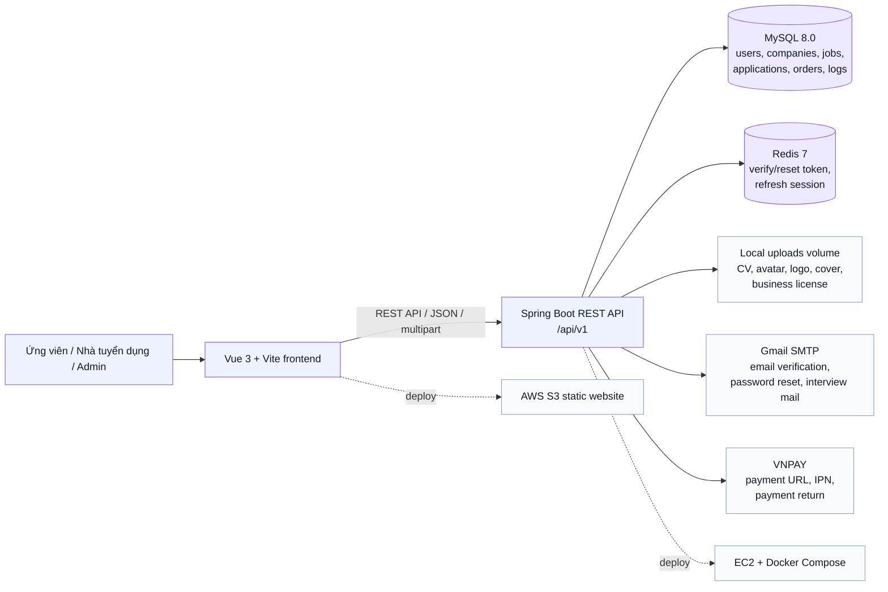

# TopViec


TopViec là hệ thống tuyển dụng trực tuyến dành cho ứng viên, nhà tuyển dụng và quản trị viên nền tảng. Dự án hỗ trợ tìm kiếm việc làm, đăng tin tuyển dụng, ứng tuyển bằng CV, quản lý quy trình phỏng vấn, dịch vụ tuyển dụng, thanh toán và kiểm duyệt nội dung.

Repository này là repo tổng/overview của hệ thống. Source code được tách thành 2 repo chính:

- **Backend repository**  
  https://github.com/ndvuongq04/topviec-be
- **Frontend repository**  
  https://github.com/ndvuongq04/topviec-fe
- **Overview repository**  
  https://github.com/ndvuongq04/TopViec

## Demo

- **Link demo**  
  http://topviec-frontend.s3-website-ap-northeast-1.amazonaws.com/
- **Frontend local**  
  http://localhost:5173
- **Backend API local**  
  http://localhost:8080/api/v1

## Demo Accounts

Các tài khoản dưới đây được seed từ backend trong `DataInitializer`.

| Role           | Email                   | Password | Permission / Note                            |
| -------------- | ----------------------- | -------- | -------------------------------------------- |
| Quản trị viên  | `superadmin@topviec.vn` | `123456` | `super_admin` - toàn quyền quản trị          |
| Quản trị viên  | `moderator@topviec.vn`  | `123456` | `content_moderator` - kiểm duyệt nội dung    |
| Quản trị viên  | `support@topviec.vn`    | `123456` | `support_admin` - hỗ trợ vận hành            |
| Quản trị viên  | `finance@topviec.vn`    | `123456` | `finance_admin` - quản lý tài chính/đơn hàng |
| Ứng viên       | `candidate@topviec.vn`  | `123456` | Tài khoản ứng viên                           |
| Nhà tuyển dụng | `employer19@topviec.vn` | `123456` | `owner`                                      |
| Nhà tuyển dụng | `manager@topviec.vn`    | `123456` | `manager`                                    |
| Nhà tuyển dụng | `recruiter@topviec.vn`  | `123456` | `recruiter`                                  |
| Nhà tuyển dụng | `viewer@topviec.vn`     | `123456` | `viewer`                                     |

## Main Features

### Auth & Public

- Đăng ký, đăng nhập, xác thực email và khôi phục mật khẩu.
- Tìm kiếm, lọc và xem chi tiết việc làm.
- Xem hồ sơ công ty và các tin tuyển dụng công khai.

### Candidate

- Quản lý hồ sơ ứng viên và CV file.
- Tìm kiếm việc làm, lưu việc làm và theo dõi công ty.
- Ứng tuyển, rút đơn và theo dõi trạng thái ứng tuyển.
- Quản lý lịch phỏng vấn và phản hồi lời mời từ Talent Pool.
- Nhắn tin với nhà tuyển dụng và gửi báo cáo/khiếu nại.

### Employer / Recruiter

- Quản lý hồ sơ công ty và thông tin xác minh.
- Quản lý thành viên, vai trò và phân quyền tuyển dụng.
- Quản lý tin tuyển dụng và phân công recruiter phụ trách.
- Quản lý ứng viên, quy trình phỏng vấn, kết quả phỏng vấn và offer.
- Quản lý Talent Pool và lời mời ứng tuyển.
- Quản lý gói dịch vụ, addon, đơn hàng và thanh toán VNPAY.
- Xử lý báo cáo/khiếu nại, nhắn tin và theo dõi nhật ký hoạt động.

### Admin

- Dashboard quản trị theo từng vai trò admin.
- Quản lý tài khoản admin, công ty/nhà tuyển dụng và ứng viên.
- Kiểm duyệt tin tuyển dụng, báo cáo/khiếu nại và điểm vi phạm.
- Quản lý gói dịch vụ, dịch vụ lẻ, addon và đơn hàng/thanh toán.
- Quản lý phân quyền hệ thống, audit log và business event log.

## Tech Stack

| Layer          | Technology                                                              |
| -------------- | ----------------------------------------------------------------------- |
| Frontend       | Vue `3.5.x`, Vite `7.3.x`, TypeScript `5.9.x`, Pinia, Vue Router, Axios |
| Styling/UI     | SCSS, Tailwind CSS `4.2.x`, Chart.js, vue-chartjs                       |
| Backend        | Java 21, Spring Boot `4.0.3`, Gradle Wrapper `9.3.1`                    |
| Security       | Spring Security, OAuth2 Resource Server, JWT, HttpOnly refresh cookie   |
| Database/cache | MySQL 8.0, Redis 7                                                      |
| File storage   | Local filesystem served through `/api/v1/files/**`                      |
| Email/payment  | Spring Mail, Thymeleaf, VNPAY                                           |
| Deploy/CI      | Docker, Docker Compose, GitHub Actions, Docker Hub, AWS S3, EC2         |

## Architecture Overview



## Repository Structure

```text
Topviec/
├── README.md
├── topviec-be/
│   ├── README.md
│   ├── src/main/java/com/topviec/topviec_be/
│   ├── src/main/resources/
│   ├── build.gradle
│   ├── Dockerfile
│   └── docker-compose.yml
└── topviec-fe/
    ├── README.md
    ├── src/
    ├── package.json
    └── vite.config.ts
```

## Deployment Structure

| Component     | Current deployment                                               |
| ------------- | ---------------------------------------------------------------- |
| Frontend      | Static build deployed to AWS S3 bucket `topviec-frontend`        |
| Backend       | Docker image `nguyendinhvuong/topviec-be:latest` deployed to EC2 |
| Database      | MySQL 8.0 container from backend `docker-compose.yml`            |
| Cache/session | Redis 7 container from backend `docker-compose.yml`              |
| Upload files  | Docker volume `uploads_data` mounted to backend container        |

## CI/CD Overview

### Backend

Workflow:

https://github.com/ndvuongq04/topviec-be/blob/main/.github/workflows/deploy-be.yml

- Trigger: push vào `main` hoặc `develop`.
- Build JAR bằng Gradle với Java 21.
- Build và push Docker image lên Docker Hub với tag `latest` và `${github.sha}`.
- SSH vào EC2, pull image mới và chạy `docker compose up -d backend`.

### Frontend

Workflow:

https://github.com/ndvuongq04/topviec-fe/blob/main/.github/workflows/deploy-fe.yml

- Trigger: push vào `main` hoặc `develop`.
- Setup Node.js 20, chạy `npm ci`.
- Build static assets bằng `npm run build` với `VITE_API_URL` từ GitHub Secrets.
- Sync thư mục `dist` lên AWS S3 bucket `topviec-frontend`.

Lưu ý: workflow đang nằm trong thư mục con. Nếu chạy GitHub Actions trực tiếp từ monorepo root, cần chuyển workflow về `.github/workflows` ở root.

## Roadmap

- Hoàn thiện các luồng nghiệp vụ chính và tối ưu trải nghiệm người dùng trước khi triển khai production ổn định.
- Bổ sung chức năng tạo và quản lý CV online cho ứng viên.
- Tích hợp AI đánh giá mức độ phù hợp giữa CV của ứng viên và JD của tin tuyển dụng.
- Tích hợp AI gợi ý việc làm phù hợp cho ứng viên dựa trên hồ sơ, kỹ năng và lịch sử ứng tuyển.
- Tích hợp AI hỗ trợ nhà tuyển dụng tìm kiếm ứng viên phù hợp với yêu cầu tuyển dụng.
- Bổ sung migration schema bằng Flyway hoặc Liquibase.
- Chuẩn hóa lại các file `.env.example` theo biến runtime hiện tại.
- Bổ sung test tự động cho backend service và frontend route/store quan trọng.
- Thêm Docker Compose profile để chạy full stack frontend + backend + database + Redis.
- Hoàn thiện tài liệu API và quy trình seed dữ liệu demo cho nhà tuyển dụng, ứng viên.
- Bổ sung realtime notification cho các luồng nhắn tin, phỏng vấn và ứng tuyển.

## Detailed Documentation

- **Backend README**  
  https://github.com/ndvuongq04/topviec-be/blob/main/README.md
- **Frontend README**  
  https://github.com/ndvuongq04/topviec-fe/blob/main/README.md

## Author and Contact

- **GitHub**  
  https://github.com/ndvuongq04
- **Repository**  
  https://github.com/ndvuongq04/TopViec
- **LinkedIn**  
  https://www.linkedin.com/in/v%C6%B0%E1%BB%A3ng-nguy%E1%BB%85n-%C4%91%C3%ACnh-a6aa42397/
- Email: nguyendinhvuong08122004@gmail.com
